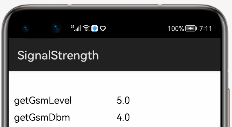

[](https://github.com/applibgroup/Signal-strengths/actions/workflows/main.yml)
[](https://sonarcloud.io/dashboard?id=applibgroup_Signal-strengths)
# Signal-strengths
SignalStrengths is a library and sample application with the purpose of getting an accurate signal strength on different HMOS phones.

For testing and experimentation purposes, a sample apk can be downloaded from this cdoe
## Source
This library has been inspired by (https://github.com/fennifith/SignalStrengths) version 1.0, released on October 19, 2018.

## Features

Signal-strengths library helps to get signal level of the avaliable networks from the device

## Dependency
1. For using Signal-strengths module in your application, include the source code and add the below dependencies in entry/build.gradle to generate hap/support.har
```
 implementation project(path: ':signalstrengths')
 testImplementation 'junit:junit:4.13'
```

2. For using Signal-strengths module in your application using the har file, add the har file in the entry/libs folder and add the dependencies in entry/build.gradle file

```
 implementation fileTree(dir: 'libs', include: ['*.har'])
 testImplementation 'junit:junit:4.13'
```

3. For using Signal-strengths module from a remote repository in your application, add the below dependencies in entry/build.gradle file.

```
TO BE UPDATED
```

## Usage

### Setup

### Listening for Signal Changes

To get your app to listen for a signal change, use RadioStateObserver class
For example how to use RadioStateObserver please refer sample app 

### Getting a Signal Value

To obtain a signal value from a `SignalStrength` , simply pass subscription Id and Context to one of the methods in the `SignalStrengths` class, which will return a number from 0-4, or -1 if an error occurs. Some examples of this are below.

#### Using a Specific Method

This allows you to specify exactly which method you want to obtain a value from.

``` java
double level = SignalStrengths.get(SignalStrengths.METHOD_LTE_LEVEL, subId, context);
```

#### First Valid Level

This gets the first valid signal level available from any method in order of accuracy. This is the most recommended way of getting a signal value, as it is the most consistently accurate across different phones and versions. See Excluding Methods, and Custom Methods sections for for ways to change this method's behavior.

``` java
double level = SignalStrengths.getFirstValid(subId,context);
```

#### Average Level

This gets the average of all the valid levels. To exclude a level, see [Excluding Methods](#excluding-methods).

``` java
double level = SignalStrengths.getAverage(subId,context);
```

### Excluding Methods

The list of methods used by `SignalStrengths` can be accessed using `SignalStrengths.getMethods()`. An example of how to exclude a method is below.

``` java
SignalStrengths.getMethods().get(5).setExcluded(true);
```

### Custom Methods

It is also possible to add your own method to the list of methods used by SignalStrengths. An example for how to create a new method is below.

``` java
SignalStrengths.getMethods().add(new SignalMethod("Method Id") {
  @Override
  public double getLevel(int subId, Context c) {
    return new Random().nextDouble();
  }
});
```

```
